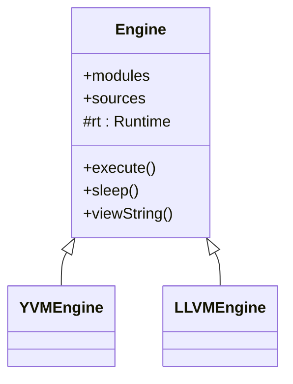

The `Yoyo::Engine` class is the abstract base for all Yoyo execution backends. It owns the module registry, source map, and the cooperative runtime scheduler. You never instantiate `Engine` directly — use [`YVMEngine`](/api/yvm-engine) or [`LLVMEngine`](/api/llvm-engine) instead.

```cpp
#include <yoyo/engine.h>
```

## Class definition

```cpp
namespace Yoyo {
    class YOYO_API Engine {
    protected:
        Runtime rt;
    public:
        Engine();
        virtual ~Engine() = default;
        Engine(Engine&&) noexcept = default;

        std::unordered_map<std::string, std::unique_ptr<ModuleBase>> modules;
        std::unordered_map<std::string, std::pair<std::string,
            std::vector<std::unique_ptr<Statement>>>> sources;

        static std::string_view viewString(void* str);
        void execute();
        void sleep(uint64_t milliseconds);

        template<class Rep, class Period>
        void sleep(const std::chrono::duration<Rep, Period>& sleep_duration);

        virtual void* createGlobalConstant(
            const Type& type,
            const std::vector<Constant>& args,
            IRGenerator*) = 0;
    };
}
```

## Public fields

<ResponseField name="modules" type="std::unordered_map&lt;std::string, std::unique_ptr&lt;ModuleBase&gt;&gt;">
  Registry of all modules known to this engine, keyed by module name. Both app modules (native C++ modules) and source modules are stored here after they are added.
</ResponseField>

<ResponseField name="sources" type="std::unordered_map&lt;std::string, std::pair&lt;std::string, std::vector&lt;std::unique_ptr&lt;Statement&gt;&gt;&gt;&gt;">
  Raw parsed source data for each Yoyo source module. The key is the module name; the value is a pair of the source text hash and the parsed AST statement list.
</ResponseField>

## Static methods

### `viewString`

Converts a Yoyo runtime string pointer to a `std::string_view` that you can read from C++.

```cpp
static std::string_view viewString(void* str);
```

<ParamField path="str" type="void*" required>
  A pointer to a Yoyo `str` value as received in a native callback. The memory is owned by the Yoyo runtime — do not free it.
</ParamField>

**Returns** a `std::string_view` into the Yoyo string's internal buffer. The view is only valid for the lifetime of the string in the Yoyo runtime.

<Warning>
  Do not store the returned `std::string_view` beyond the duration of the native callback. The underlying Yoyo string may be moved or freed when execution continues.
</Warning>

**Example** — reading a Yoyo string inside a native function:

```cpp
// Native function registered with addFunction
int32_t print_and_return(void* yoyo_str) {
    std::string_view sv = Yoyo::Engine::viewString(yoyo_str);
    std::cout << sv << std::endl;
    return static_cast<int32_t>(sv.size());
}
```

## Instance methods

### `execute`

Runs the cooperative scheduler until all fibers have completed.

```cpp
void execute();
```

Call this after [`prepareForExecution`](/api/yvm-engine#prepareforexecution) and after creating at least one fiber. `execute` returns only when every scheduled fiber has finished or yielded to a terminal state.

**Example:**

```cpp
Yoyo::YVMEngine engine;
auto mod = engine.addModule("main", source);
engine.compile();
engine.prepareForExecution();

auto fn = engine.findFunction(mod, "main::entry").value();
auto fiber = engine.createFiber(fn);
engine.execute(); // runs until fiber completes
```

### `sleep` (milliseconds)

Suspends the currently executing fiber for the specified number of milliseconds, yielding control to the scheduler.

```cpp
void sleep(uint64_t milliseconds);
```

<ParamField path="milliseconds" type="uint64_t" required>
  The minimum number of milliseconds to suspend the current fiber.
</ParamField>

<Note>
  This method is intended to be called from within a running Yoyo fiber or a native callback invoked from one. Calling it outside of a fiber context has undefined behavior.
</Note>

### `sleep` (duration)

Template overload that accepts any `std::chrono::duration`. Internally converts to milliseconds.

```cpp
template<class Rep, class Period>
void sleep(const std::chrono::duration<Rep, Period>& sleep_duration);
```

<ParamField path="sleep_duration" type="std::chrono::duration&lt;Rep, Period&gt;" required>
  A standard chrono duration value. Any duration type is accepted; it is cast to milliseconds before scheduling.
</ParamField>

**Example:**

```cpp
using namespace std::chrono_literals;
// Inside a native callback called from a Yoyo fiber:
engine.sleep(250ms);
```

## Protected fields

<ResponseField name="rt" type="Runtime">
  The cooperative runtime scheduler. Manages all live fibers, waiting queues, and dead coroutine cleanup. See [`Runtime`](/api/runtime) for details.
</ResponseField>

## Inheritance



## See also

- [`YVMEngine`](/api/yvm-engine) — bytecode interpreter backend
- [`LLVMEngine`](/api/llvm-engine) — JIT-compiled LLVM backend
- [`Runtime`](/api/runtime) — cooperative fiber scheduler
- [`ModuleBase`](/api/module-base) — module interface
